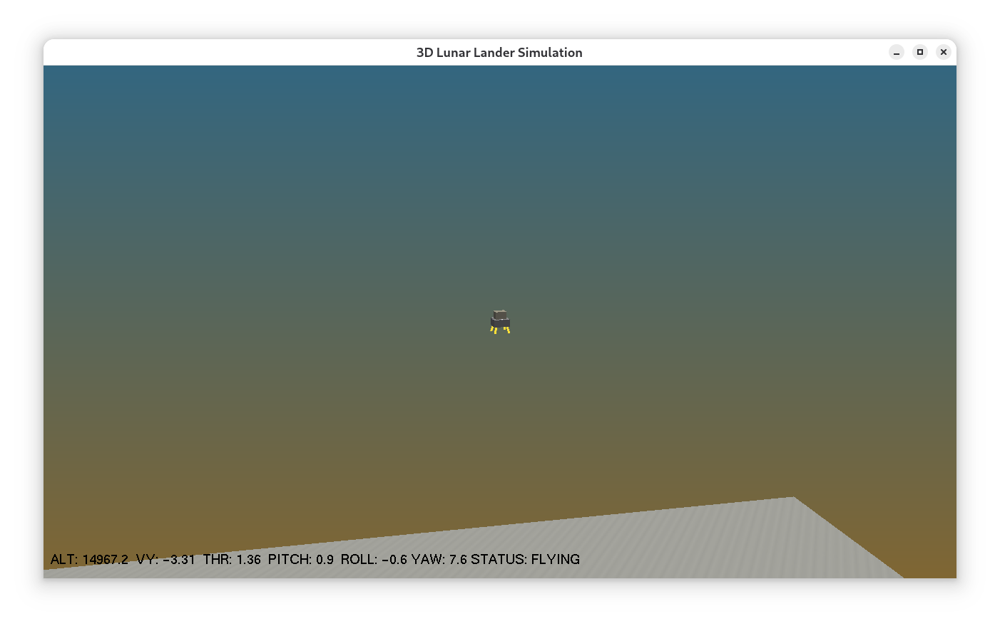
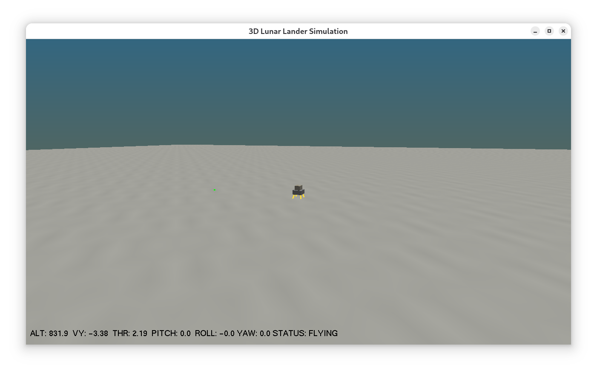
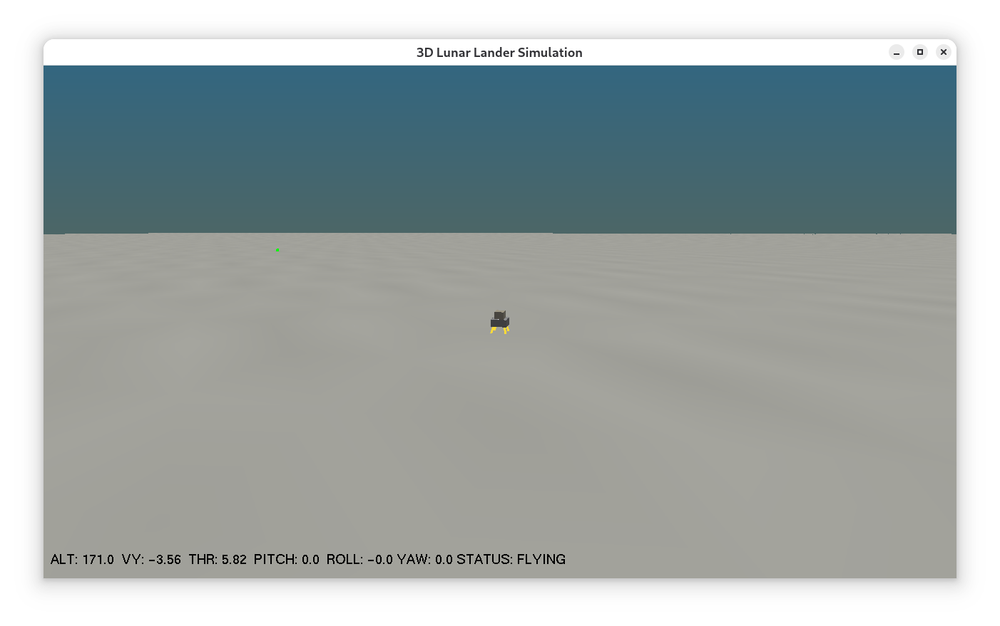
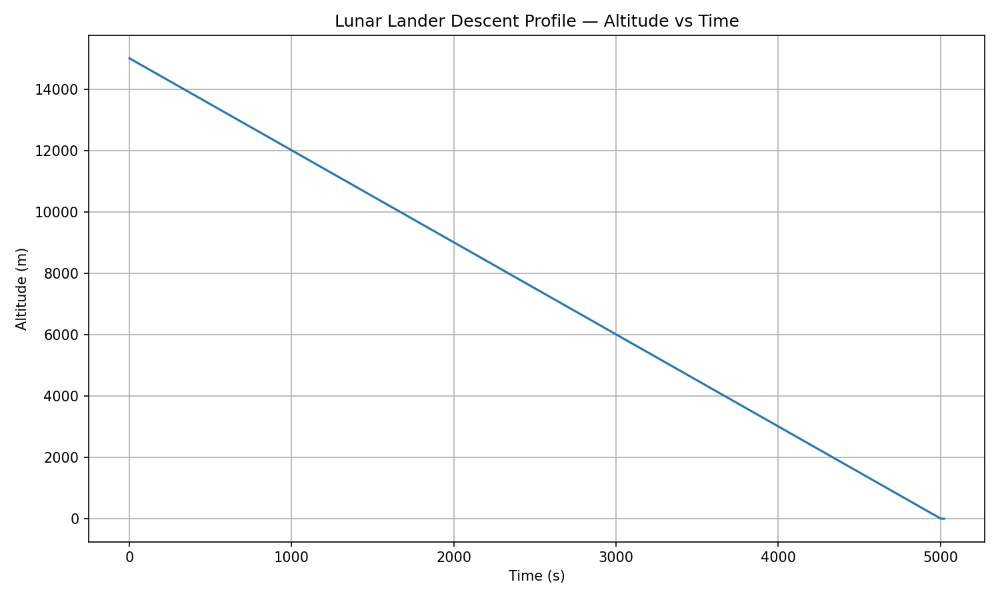
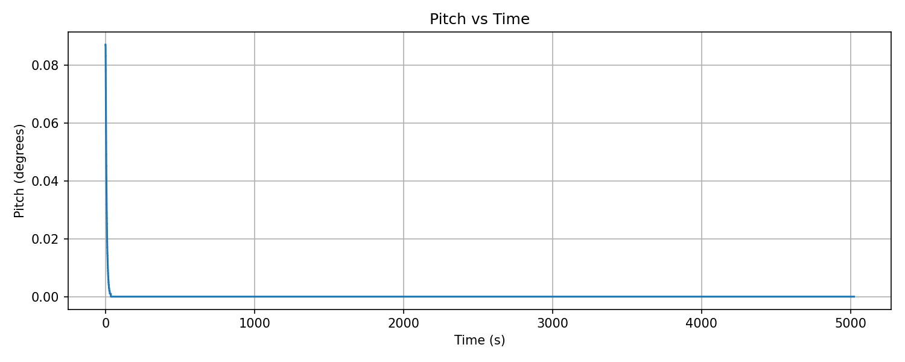
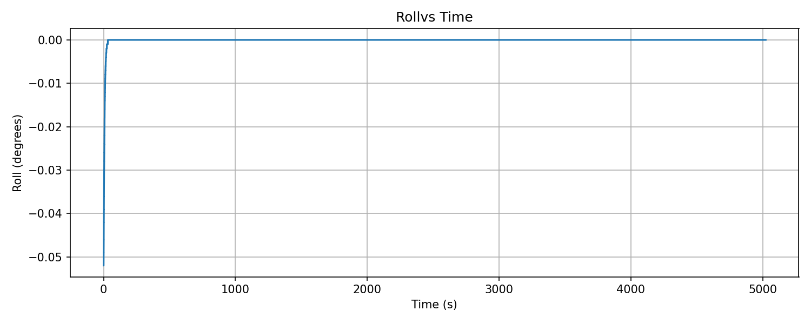

# Lunar Lander 3D Simulation

A 3D physics-based lunar spacecraft descent simulation using OpenGL with real rotational dynamics and an autopilot that controls vertical descent using the main engine thruster and stabilises pitch, roll and yaw angles using side thrusters with closed-loop PD torque control. The simulation loop uses fixed-step physics.

The 3D lunar lander simulation attempts to mimic a real spacecraft control system such as that used with the Apollo Lunar Module descent engines, which actively modulated pitch/roll/yaw angles using RCS (Reaction Control System) thrusters. 
    
Some images of the 3D lunar lander simulation are shown below.


  




## Overview

The purpose of the simulator is to model the descent of the Apollo style lunar lander under realistic moon gravity taking mass and pitch, roll and yaw angles into account. It was the Apollo Guidance Computer (autopilot) that landed men on the moon. Consequently, the focus of the work has been the development of the autopilot. The autopilot performs a smooth descent. 

The simulator has been written in C and OpenGL and can be compiled and run on Linux. The simulator graphics are basic. The lunar module is drawn using cubes for the ascent and descent body modules and lines for the legs. The moon surface is drawn using a rectangular height field.

I had originally planned to create the 3D lunar lander simulation using OpenGL and SDL3. SDL3 would manage input, windowing, and timing, while OpenGL handles 3D rendering and camera projection. However, this did not work out and so I have completely rewritten the simulator using standard C and OpenGL.

## Features

List core features as concise bullet points:

* Physics-accurate rotational dynamics 
* Autopilot with smooth descent
* Integrated telemetry logging (autopilot_telemetry.csv)

## Apollo Missions

The simulator has been inspired by the lunar landing Apollo missions. Between 1969 and 1972 six NASA Apollo missions (Apollo 11,12,14,15,16 and 17) took astronauts to the moon using the Apollo Lunar Excursion Module or LEM. Each LEM  was able to take two of the three man Apollo crew to the moon so that overall 12 men were taken to the surface of the moon. When close to the moon the Apollo spacecraft established an elliptical parking orbit around the moon. The LEM was then uncoupled from the Command & Service Module which remained in moon orbit. The LEM then slowed and moved into an orbit that took it to about 8 miles (13 km) from the moon's surface and then initiated a PDI (Powered Descent Initiation) sequence to descent and land on the  moon surface. 

| Mission    |Landing Site                 | Notes                                                                                                      |
|------------|-----------------------------|------------------------------------------------------------------------------------------------------------|
| Apollo  11 | Mare Tranquillitatis        | Eagle, Neil Armstrong & Buzz Aldrin first men on the moon                                                  |
| Apollo  12 | Oceanus Procellarum         | Intrepid, astronauts Pete Conrad and Alan Bean visited the Surveyor 3 probe, moonquake recording equipment |
| Apollo  14 | Fra Mauro                   | Two wheeled equipment trolley to carry tools and samples                                                   |
| Apollo  15 | Hadley Rille                | Lunar Roving Vehicle used to explore lunar surface                                                         |
| Apollo  16 | Descartes Highlands         | Lunar Roving Vehicle used to explore lunar surface                                                         |
| Apollo  17 | Taurus-Littrow        	   |Lunar Roving Vehicle used to explore lunar surface                                                          |

Mare Tranquillitatis was chosen as the first landing site because it was a huge impact basin considered flat and so suitable for landing and take-off. Apollo 11 LEM known as Eagle touched down about 4 miles (about 6 km) away from the target position. The landing sites for Apollo's 12, 14, 15, 17 were chosen on the basis of being low-lying and relatively flat. Apollo 12 landed in the a relatively flat area in the Sea of Storms to visit the Surveyor 3 probe (the only probe visited by humans on another world). The Apollo 16 landing site was Descartes Highlands which was a more heavily cratered site. Apollo 13 did not land on the moon due to an explosion in an oxygen tank and so ended up flying around the moon back to earth.
 

## Coordinate System and Angles

The simulation uses a right-handed world coordinate system:
```
+X  - horizontal right
+Y  - vertical up (against gravity)
+Z  - horizontal forward
```
Moon gravity acts in -Y direction.
  
The lander orientation uses intrinsic Euler rotations in the order:
```
1. roll   about +Z axis
2. pitch  about +Y axis
3. yaw    about +X axis
```

Angles are stored in radians:

```
roll = φ      pitch = θ      yaw = ψ
roll_rate = φ̇   pitch_rate = θ̇   yaw_rate = ψ̇

```
The lander’s main engine thrust vector in local space is always (0, +1, 0) (straight “up” from the lander’s frame).

## Reaction Control System (RCS) Forces & Torques

Four side thrusters generate pitch and roll torques. The front thruster provides a positive pitch angle torque. The back thruster provides a negative pitch angle torque. The right thruster provides a positive roll angle torque. The left thruster provides negative roll angle torque. Two yaw thrusters generate yaw torque (yaw left and yaw right)

Side thrusters output force is proportional to their normalised level (0..1):

F_thruster = level · RCS_THRUST_MAX     (newtons)

## Lander Structure

The lander’s physical and control state is stored in a structure:
```
typedef struct {
    Vec3 pos;
    Vec3 vel;
    Vec3 acc;
    float pitch, roll, yaw;          // radians
    float pitch_rate, roll_rate,yaw_rate;     // rad/s 
    float mass; //mass
    //float pitch_rate, roll_rate, yaw_rate; 
	float Ixx, Iyy, Izz;   // principal moments of inertia (kg·m^2) 
    // Main engine
    float thrust_level;              // 0..1
    // RCS (reaction control system) thruster levels
    float rcs_front;                 // pitch down
    float rcs_back;                  // pitch up
    float rcs_left;                  // roll right
    float rcs_right;                 // roll left
    // Torques computed from RCS thrusters
    float torque_pitch;              // about X-axis (pitch)
    float torque_roll;               // about Z-axis (roll)  
    float torque_yaw; 		    // about Y -axis (yaw)        
	// RCS yaw thruster levels
	float rcs_yaw_left;  // produces positive yaw torque (ccw around +Y)
	float rcs_yaw_right; // produces negative yaw torque	
    bool is_landed;
    bool autopilot_enabled;
} Lander3D;
```

## Torques (τ) from Thruster Forces

Pitch torque (around X-like axis):
```
τ_pitch = (F_front - F_back) · d
```

Roll torque (around Z-like axis):
```
τ_roll = (F_right - F_left) · w
```

Yaw torque (around Y axis):
```
τ_yaw = (F_yaw_left - F_yaw_right) · r_yaw
```

## Rotational Dynamics

To describe a real spacecraft lunar landing like the Apollo mission a rigid-body physics model has to be developed to produce a controllable, tunable and realistic simulation. The physics symbols used in the equations below are defined Appendix Physics Symbols Table.

The lander rotational dynamics follow the rigid-body equation:
```
τ = I · α
```

That is, torque = moment of inertia x angular acceleration (like F=ma).

So angular accelerations for the pitch, roll and yaw angles are:

```
α_pitch = τ_pitch / Ixx
α_roll  = τ_roll  / Izz
α_yaw   = τ_yaw   / Iyy
```

### Integrating angular rates

```
φ̇ += α_roll  · dt
θ̇ += α_pitch · dt
ψ̇ += α_yaw   · dt

```
### Rotational damping

A simple viscous damping model prevents oscillations:
```
φ̇ -= φ̇ · D · dt
θ̇ -= θ̇ · D · dt
ψ̇ -= ψ̇ · D · dt

```

Where D is a tunable damping constant (≈ 1.0–3.0).

### Integrating attitude

```
φ += φ̇ · dt
θ += θ̇ · dt
ψ += ψ̇ · dt
```
Yaw is normalized to:
```
−π ≤ ψ ≤ +π
```

## Main Engine Thrust & Translation

The main engine produces a force along the lander’s local +Y axis:

```
F_engine = (0, thrust_force, 0)
thrust_force = thrust_level · ENGINE_THRUST
```

Convert to world coordinates using the Euler rotation matrix R(φ,θ,ψ):
```
F_world = R · F_engine
```
Acceleration in world space:
```
a_x = F_world.x / mass
a_y = F_world.y / mass − g_lunar
a_z = F_world.z / mass
```
Velocities:
```
v_x += a_x · dt
v_y += a_y · dt
v_z += a_z · dt
```
Positions:
```
x += v_x · dt
y += v_y · dt
z += v_z · dt
```

## Autopilot 

The purpose of the autopilot is to control the following.
```
Vertical descent speed
Pitch and roll stabilization
Yaw stabilization
Safe touchdown near zero velocity
```
Everything is powered by the main engine and the RCS side thrusters.

The autopilot is divided into three independent control loops. One for vertical descent, one for attitude control (pitch and roll) and one for yaw angle stabilisation.

Each loop uses a Proportional (P) or Proportional plus Derviative (PD) controller to produce a controllable, tunable, and realistic simulation.

#### Vertical Descent Controller (P-Control)

The goal of the verical descent controller is to maintain a target descent rate of around  –3 m/s. Main engine thrust is controlled around a thrust level using a proportional controller. See equation below. 

```
thrust_cmd = thrust_level + Kp_v · (target_v − v_y)
```
This keeps the lander from either falling too fast or rising back into space.

### Attitude Stabilization (Pitch & Roll PD Control)

The goal of the attitude stabilization controller is to maintain pitch and roll angles at zero.
To do this it computes the the torque for pitch and roll using the equations shown below.

```
τ_pitch_cmd = Kp_ang · (−pitch) + Kd_ang · (−pitch_rate)
τ_roll_cmd  = Kp_ang · (−roll)  + Kd_ang · (−roll_rate)
```
These torques are converted into RCS thrust levels via the function:
```
apply_attitude_thrusters_from_torques()
```

This produces front/back thrust from the pitch torque and left/right thrust from the roll torque.
These stabilise lander angles before landing.

### Yaw Stabilization (Yaw PD Control)

The goal of the yaw control loop is to maintain the yaw angle at zero. To do this it computes yaw torque.

```
τ_yaw_cmd = Kp_yaw · (−yaw) + Kd_yaw · (−yaw_rate)
```
This torque is converted to RCS yaw thrusters using the function:
```
apply_yaw_thrusters_from_torque()
```

### Touchdown Logic

When the lander reaches the terrain plane (typically y = 0) all engines are turned off and pitch/roll angles set to zero.
```
if y ≤ 0:
    y = 0
    v = 0
    φ = θ = ψ = 0
    φ̇ = θ̇ = ψ̇ = 0
    thrust_level = 0
    RCS thrusters = 0
    is_landed = true

```

## Telemetry and Analysis

The simulation logs autopilot telemetry to the file telemetry.csv which can be used for telemetry analysis of the autopilot.

The altitude versus time plot shows a steady descent from 15000 m which is what is required for a safe landing.



The pitch and roll angles versus time plots are shown below. Following an injection of pitch and roll disturbance at t=0 these show that the lander stabilizes the angles to zero.




A yaw angle disturbance is also stabilised. These plots confirm that the autopilot is correctly balancing thrust, descent rate and orientation.

## Build From Source

The C source code is provided in the src directory. 

### Build From Source (Debian 13)

The instructions below show how to build and run the simulator from source using Debian 13 Trixie. 
The simulator has been developed using Debian Trixie.

You need to install the following packages.

```
sudo apt-get update
sudo apt install build-essential
```
Then install OpenGL and GLUT.

```
sudo apt install mesa-utils
sudo apt install libglu1-mesa-dev
sudo apt install freeglut3-dev
sudo apt install mesa-common-dev
```
To check the OpenGL version use the command below.
```
glxinfo | grep "OpenGL version"
```
and then
```
dpkg -s libglu1-mesa
```

Use the MAKEFILE to compile the lunar lander simulator. 

```
make
```

To run the lundar lander simulation from the terminal use:

```
./lander3d
```

Make clean is also supported.

```
make clean
```

## Controls & Keyboard Commands

Short table of keys:

| Key   | Action             |
| ----- | -------------------|
| C     | Toggle camera mode |
| R     | Restart	     |
| Esc   | Quit 	             |

The C key toggles the camera mode between orbit, overhead and chase.

## Future Work 

* Tuning of PD gains
* Fuel usage model
* Improved target site selection and steering to an alternate landing site if needed
* Particles system for thrusters
* Terrain modelling

## License

The lunar lander simulator is released under the terms of the [GNU Lesser General Public License version 3.0](https://www.gnu.org/licenses/licenses.html). 

Under no circumstances should you use the autopilot developed in this simulation to attempt to land a craft on the moon or any other planet. It has been developed for educational purposes. If in doubt consult a NASA engineer. 

## Version Control

[SemVer](http://semver.org/) is used for version control. The version number has the form 0.0.0 representing major, minor and bug fix changes.

The code will be updated as and when I find bugs or make improvement to the code base.

## Author

* **Alan Crispin** [Github](https://github.com/crispinprojects)

## Project Status

Active and under development.

## Acknowledgements

* [Apollo 11: The Complete Descent](https://www.youtube.com/watch?v=xc1SzgGhMKc)

* [Apollo 12: The Complete Descent](https://www.youtube.com/watch?v=NkcIxPi4_S4)

* [Light Years Ahead The 1969 Apollo Guidance Computer](https://www.youtube.com/watch?v=B1J2RMorJXM&t=203s)

* [Simulating a lunar landing](https://www.spaceacademy.net.au/flight/sim/lunasim.htm)

* [BBC Sky At Night: All 6 Apollo landing sites on the Moon](https://www.skyatnightmagazine.com/advice/skills/see-apollo-landing-sites-moon)

* [LM Descent to the Moon - Part 1 - Theory and Software](https://dodlithr.blogspot.com/2014/08/lm-descent-to-moon-part-1-theory-and.html)

* [SDL](https://www.libsdl.org/)

* [chatGPT](https://chatgpt.com/)

* [Gemini](https://gemini.google.com/app)

* [Geany](https://www.geany.org/) is a lightweight source-code editor [GPL v2 license](https://www.gnu.org/licenses/old-licenses/gpl-2.0.txt)

* [Debian](https://www.debian.org/)


## Appendix: Physics Symbols Table 
```
| Symbol                      | Meaning                                | Units         |
| --------------------------- | -------------------------------------- | ------------- |
| **x, y, z**                 | Lander world position                  | m             |
| **v_x, v_y, v_z**           | World velocities                       | m/s           |
| **a_x, a_y, a_z**           | World accelerations                    | m/s²          |
| **φ (roll)**                | Roll angle (about Z-axis)              | rad           |
| **θ (pitch)**               | Pitch angle (about X-axis)             | rad           |
| **ψ (yaw)**                 | Yaw angle (about Y-axis)               | rad           |
| **φ̇, θ̇, ψ̇**                 | Angular rates (roll/pitch/yaw)         | rad/s         |
| **φ̈, θ̈, ψ̈**                 | Angular accelerations                  | rad/s²        |
| **Ixx, Iyy, Izz**           | Principal moments of inertia           | kg·m²         |
| **m**                       | Lander mass                            | kg            |
| **g**                       | Lunar gravitational acceleration       | m/s²          |
| **F_front, F_back**         | Upward forces from front/back RCS      | N             |
| **F_left, F_right**         | Upward forces from left/right RCS      | N             |
| **F_yaw_left, F_yaw_right** | Upward forces from yaw RCS             | N             |
| **w, d, r_yaw**             | Lever arms (thruster offsets from CoM) | m             |
| **τ_pitch, τ_roll, τ_yaw**  | Torques about pitch/roll/yaw axes      | N·m           |
| **thrust_level**            | Main engine throttle (0..1)            | dimensionless |
| **ENGINE_THRUST**           | Max main engine thrust                 | N             |
| **RCS_THRUST_MAX**          | Max side-thruster force                | N             |
| **F_engine**                | Main engine force vector               | N             |
| **R(φ,θ,ψ)**                | Euler rotation matrix (local→world)    | —             |
| **dt**                      | Simulation timestep                    | s             |
| **D, D_yaw**                | Damping constants                      | 1/s           |
| **target_v**                | Desired descent velocity               | m/s           |
| **Kp_v**                    | Vertical velocity P-gain               | —             |
| **Kp_ang, Kd_ang**          | Attitude PD gains                      | —             |
| **Kp_yaw, Kd_yaw**          | Yaw PD gains                           | —             |
```

## Appendix: Summary of Core Equations

Torque from forces:
```
τ = r × F
```
Angular acceleration:
```
α = τ / I
```
Euler rate integration:
```
ω += α · dt
θ += ω · dt
```
Rotational damping:
```
ω -= ω · D · dt
```
Main engine thrust:
```
a = (R(φ,θ,ψ) · (0, thrust, 0)) / mass  −  (0, g, 0)
```
Linear integration:
```
v += a · dt
p += v · dt
```
## Appendix: Flowchart

The flowchart for the entire simulation matching program flow is shown below.

```
+--------------------------------------------------------------+
| Start Program                                                |
+--------------------------------------------------------------+
                |
                v
       +--------------------+
       | init_lander3d()    |
       +--------------------+
                |
                v
   +-----------------------------+
   | Main Loop (renderScene)     |
   +-----------------------------+
                |
                v
   +-----------------------------+
   | Accumulate frame time       |
   +-----------------------------+
                |
                v
   +-----------------------------+
   | while accumulator >= dt     |
   +-----------------------------+
                |
                v
        +--------------------------+
        | autopilot_test_harness() |
        +--------------------------+
                |
                v
        +--------------------------+
        | autopilot_guided_full()  |
        +--------------------------+
                |
                v
        +--------------------------+
        | update_lander3d()        |
        +--------------------------+
                |
                v
        +--------------------------+
        | telemetry_log()          |
        +--------------------------+
                |
                v
        +--------------------------+
        | accumulator -= dt        |
        +--------------------------+
                |
                v
   +-----------------------------+
   | Rendering Phase             |
   +-----------------------------+
                |
                v
   +-----------------------------+
   | glClear                     |
   | update_camera               |
   | draw_sky                    |
   | draw_terrain                |
   | draw_lander                 |
   | draw_target_marker          |
   | draw_HUD                    |
   +-----------------------------+
                |
                v
   +-----------------------------+
   | swap buffers (double buf)   |
   +-----------------------------+
                |
                v
           repeat loop
```

