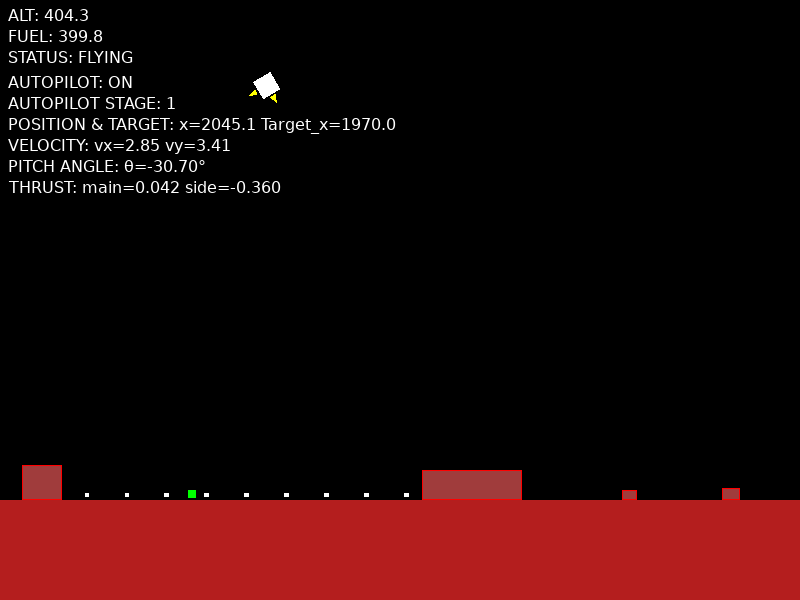

# Lunar Lander Simulation

This project simulates a **lunar landing** sequence. It can be operated using either the **autopilot** system or manually. The simulator is written in **C** using **SDL3** and has been inspired by the Apollo lunar landings.  It uses an Apollo-style PDI (Powered Descent Initiation) autopilot to manage the descent phases.

An animated GIF (Graphics Interchange Format) file demonstrating the autopilot landing the lunar module is shown below.


  
The GIF image file displays a sequence of images in succession to create a short, repeating animation of a lunar landing using the autopilot.


The focus of the work has been the development of the autopilot. It was the Apollo Guidance Computer (autopilot) that landed emn on the moon. You can switch off the autopilot using the P-key (Pilot key) and then fly the lunar module manually using the W(UP ARROW), A(LEFT ARROW) and D(RIGHT ARROW) keys. 

The simulator graphics are basic. The lunar module is drawn as a filled rotated rectangle using two triangles. The main and side thruster flames are drawn using triangles. 

## SDL

**Simple DirectMedia Layer (SDL)** — [SDL Wiki](https://wiki.libsdl.org/SDL3/FrontPage)

SDL is a cross-platform development library that provides low-level access to:
- Audio
- Keyboard and mouse input
- Joysticks and game controllers
- Graphics hardware (via OpenGL, Vulkan, etc.)

It is widely used for **game development**, **physics simulations**, and **interactive multimedia applications** across major platforms (Linux, macOS, Windows, etc.).

This project uses the latest **SDL3** version. 
You can find the official SDL3 API reference [here](https://wiki.libsdl.org/SDL3/APIByCategory).


## Coding the Physics

When the lunar module is in free fall, it is pulled toward the Moon’s surface by **lunar gravity**, approximately:

```
const float GRAVITY = 1.62f;
```
This is about 16.6% of Earth's gravity, due to the Moon’s smaller mass and radius.

### Coordinate System

The simulation uses a 2D Cartesian coordinate system where:

(0, 0) is the top-left corner of the screen.

The x-axis increases to the right.

The y-axis increases downwards.

Thus, during free fall, the lander’s y value increases as it descends.

The altitude (alt) above the surface is calculated using:
```
float alt = (float)(SURFACE_Y - lander->y);
```
If SURFACE_Y = 520 and lander->y = 20, then alt = 500.

The → (arrow) operator is used to access members of a structure pointer. For example, lander->y retrieves the y coordinate of the lander structure.

## Lander Structure

The lander’s physical and control state is stored in a structure:

```
typedef struct {
    float x, y;			//position
    float vx, vy;		//velocity
    float thrust_level;        // main engine throttle (0.0–1.0 )
    float side_thrust_level;   // side thrusters (-1.0=left, +1.0=right)
    float fuel;                // remaining fuel 
    float angle;    
    float dry_mass;            // dry mass (kg) of the lander **without** fuel     
    float theta;     	   	// orientation radians (0 = upright engines down)
    float omega;      		// angular velocity radians/sec    
    bool thrust;   
    bool is_landed;
    bool is_crashed;
    bool is_hovering;
    bool hazard_ahead;  
    bool left_thruster;
    bool right_thruster;
} Lander;
```

The craft has three engines:

* One main engine for vertical thrust
* Two side thrusters for lateral motion

The fields thrust_level and side_thrust_level determine the normalized power levels of these engines.

Fuel level is limited and decreases over time.

## Free Fall and Kinematics

With no thrust applied, the lander accelerates downward at 1.62 m/s².

Using standard kinematics

```
s = ut + ½ a t²
```

For a 500 m fall starting from rest:

```
-500 = 0.5 × -1.62 × t²
t ≈ 78 s
```

Impact velocity:
```
v = u + a t = 0 + (-1.62) × 78 = -126 m/s
```

Clearly, the safe landing of the craft requires firing the main engine to counter gravity. Thrust acceleration is calculated via F = m × a, where m is the lander’s mass.

The x-axis motion also has to be taken into account as in this simulation as we are dealing with projectile motion. The horizontal and vertical motion are independent of one another. Each direction gets it own equation. In the simulation code the variable vx is used to represent the x-axis velocity of the lander and the variable vy the y-axis velocity of the lander.

```
vx = ux + ax t
vy = uy + ay t
```


## Time Step Integration

The simulation runs at a fixed update rate:

```
const double TIME_SLICE = 1.0 / 60.0;
double dt = TIME_SLICE;
```

Each frame, the lander’s motion is integrated using a StepLander() function:
```
float ay = GRAVITY;                 // acceleration due to gravity
ay -= MAIN_THRUST_ACCEL * frac;     // countered by main engine
```
MAIN_THRUST_ACCEL is defined as:
```
const float MAIN_THRUST_ACCEL = 9.0f;
```
and frac is the current thrust_level (0.0 – 1.0).

The velocity and position updates are calculated using the equations below:
```
lander->vx += ax * (float)dt;
lander->vy += ay * (float)dt;
lander->x  += lander->vx * (float)dt;
lander->y  += lander->vy * (float)dt;
```
These are the classic Euler integration equations used in many real-time physics engines.

Mass decreases as fuel burns, slightly increasing acceleration for a given thrust.
To improve realism the mass in kg is computed from the lander mass without fuel (dry mass) and the current fuel mass.
``` 
    float fuel_mass_kg = lander->fuel * FUEL_UNIT_MASS_KG;
    float mass_kg = lander->dry_mass + fuel_mass_kg;
```


## Graphics and Camera System

The simulator uses a side-scrolling camera to make the 800 × 600 viewport move smoothly over the 8000 pixel-wide lunar surface:

```
#define WINDOW_WIDTH 800
#define WINDOW_HEIGHT 600
#define WORLD_WIDTH 8000.0f
```

To convert world coordinates (the lander’s absolute position) to screen coordinates, the following function is used:

```
static inline void WorldToScreen(const Camera* cam, float wx, float wy, SDL_FRect* out) {
    out->x = wx - (cam->x - (float)WINDOW_WIDTH / 2.0f);
    out->y = wy - (cam->y - (float)WINDOW_HEIGHT / 2.0f);
    out->w = out->h = 0.0f;
}
```
The camera follows the lander using lead and bias constants:
```
camera.x = lander.x + CAMERA_LEAD_PIXELS;
camera.y = SURFACE_Y - WINDOW_HEIGHT / 2.0f + CAMERA_VERTICAL_BIAS;
```

## Autopilot System

The descent autopilot is inspired by the Apollo Lunar Module PDI (Powered Descent Initiation) sequence. The autopilot function controls the lunar lander’s powered descent phase. It combines a vertical PD controller for descent rate control, a lateral PD controller for horizontal targeting, and a pitch stabilization loop for orientation control. The logic is designed to provide a smooth, energy-efficient descent to a pre-selected landing site.

The autopilot logic is structured in discrete stages representing key phases of a lunar descent. Stage-dependent target velocities and gains provide smooth transitions between braking, controlled descent, and hover. The result is a mostly stable, repeatable landing sequence adaptable to variable terrain (see Terrain Safety section below).


## Control Logic

Main Control Loops:

### Lateral Guidance

* A proportional–derivative controller drives the craft horizontally toward the best landing site (target_x).
* Uses position error (dx) and horizontal velocity (vx) to compute a small side_thrust_level. The result is smoothed (low-pass filtered) to prevent oscillations.

### Vertical Descent Control

* The altitude range is divided into zones (high → medium → low), each with its own target descent velocity (target_vy).
* A PD-style vertical controller computes the required vertical acceleration (ay_des) based on the descent rate error.
* The total thrust level (thr) is then computed as:
        
        ```
        thr = (GRAVITY - ay_des) / (MAIN_THRUST_ACCEL * mass_scale);
        
        mass_scale = NOMINAL_MASS_KG / mass_kg;        
        ```

This equation reduces throttle as the craft falls too slowly, and increases it if the descent rate is too fast.

### Flare and Anti-hover Logic

* Near the surface (below 25 m), the autopilot gradually increases throttle to slow descent — the flare.
* A small anti-hover bias ensures the craft doesn’t get stuck hovering by reducing thrust slightly if it’s barely descending.

#### Pitch and Attitude Control
* A light PD controller on pitch angle (θ) stabilizes the craft toward upright (0 rad).
* Includes damping (Kd_theta) on angular velocity (ω) to prevent oscillation.
* The pitch angle is limited to ±30°, consistent with engine thrust vector geometry.

### Touchdown Logic

* Below touchdown altitude (ALT_TOUCHDOWN ), the autopilot checks the vertical and horizontal speeds.
* If the descent rate and lateral velocity are within safe bounds, it declares a successful landing.
* Otherwise, it triggers a crash event for analysis.

### Design Features

* Adaptive Throttle Control: Adjusts for varying mass as fuel is burned (mass_scale).
* Progressive Descent Profile: Different target descent rates for different altitude bands ensure both efficiency and safety.
* Pitch Damping: Prevents over-rotation and thrust vector inversion that previously caused the craft to accelerate upward.
* Robust Against Hover Lock: Prevents getting stuck midair due to small velocity errors.
* Telemetry System: Prints detailed step-by-step diagnostic data for flight analysis.

The autopilot uses the  AutopilotState data structure as shown below.

```
typedef struct {
	bool enabled;
    int stage;
    float target_theta; // desired attitude for roll-align stage 
    float theta_cmd;
    double burn_timer;
    double last_throttle; 
    float target_x;             // selected landing site world x 
    float target_y;             // optional: 
    float target_score;         // safety score (0..1) of selected site
    float stage_timer;
    bool has_target;            // true when a target is locked    
    double scan_last_time;      // last time we did full predictive scan   
    int site_mem_count;  // site memory (ring buffer)
    int site_mem_head;
    CandidateSite site_mem[16]; // small ring buffer of previously-scored sites
} AutopilotState;
```

The vertical velocity vs time plots for the autopilot is shown below.

The main engine throttle and side thrust profile plotted again time during an autopilot landing is shown below.


### Terrain Safety

Terrain safety is determined through a predictive scan routine that evaluates several lateral positions below the vehicle, assigning each a safety score based on local hazard geometry. The white dots are the sample positions evaluated in each scan sweep. The highest-scoring site becomes the target landing point, shown visually as a green marker on the surface.

The predictive, higher-altitude scan to select a landing point is attempting to simulate the  “landing point designator” approach used in the Apollo missions. 

The system flow components for finding a safe location to land are shown below.

```
        +--------------------------------------+
        |        AutoPilot_Update()            |
        +--------------------------------------+
                     
                     v
          +----------------------+
          | PredictiveScan()     | → produces N white dots
          +----------------------+
                     
                     v
          +----------------------+
          | ComputeLandingZone   | → safety score per dot
          +----------------------+
                     
                     v
          +----------------------+
          | SelectBestSite()     | → picks green dot (target)
          +----------------------+
                     
                     v
          +----------------------+
          | LateralControl       | → steers toward green dot
          +----------------------+
                     
                     v
          +----------------------+
          | DrawPredictiveOverlay|
          +----------------------+

```

The PredictiveScan() function implements a simple loop scanning columns in front of the current lander and stores top candidates into ap->site_mem. ComputeLandingZoneSafetyAtX() accepts an x_center parameter and returns score. SelectBestSite() picks the best candidate (highest weighted score).

## Autopilot Tuning

The autopilot parameters need to be tuned. See the parameter tuning Appendix.


## Head-Up Display (HUD)

The HUD shows real-time flight parameters:
```
ALT: 404.3
FUEL: 399.8
STATUS: FLYING
AUTOPILOT: ON
AUTOPILOT STAGE: 1
POSITION & TARGET: x=2045.0 Target_x=1970.0
VELOCITY: vx=2.85  vy=3.41
PITCH ANGLE: θ=-30.70°
THRUST: main=0.042 side 0.360
```



An audio bleep is played at regular intervals to indicate that a landing simulation is in progress. You can switch off bleeping by using:
bool is_bleeping =false;

Telemetry data is captured with each simulation run and stored in the current working directory in a file called "autopilot_telemetry.csv".

## How to Use Lunar Lander Simulator

Because SDL is a cross-platform development library the simulator code can be compiled on major platforms (Linux, macOS, Windows, etc.) which support SDL3 and a C compiler. The C source code is provided in the src directory.

## Build From Source (Debian 13)

The instructions below show how to build and run the simulator from source using Debian 13 Trixie. The simulator has been developed using Debian Trixie.

You need to install the following packages.

```
sudo apt-get update
sudo apt install build-essential
sudo apt install pkg-config
sudo apt install libsdl3-dev
```

To check that SDL3 is installed use the following commands.

```
pkg-config --libs sdl3
pkg-config --cflags sdl3
```

Use the MAKEFILE in the src download to compile. 

```
make
```

To run the simulation from the terminal use

```
./lunar
```

Make clean is also supported.

```
make clean
```


## Build From Source (Windows 11)

The instructions below show how to build the simulator from source using Windows 11.

### Setting Up SDL3 on Windows 11

1. Install Prerequisites

Compiler: Install MSYS2 (MinGW)
   
2. Get the SDL3 Development Libraries

The simplest option is to use the prebuilt binaries which can found using the link below.

[SDL3 binaries](https://github.com/libsdl-org/SDL/releases)

```	
C:\SDL3\include
C:\SDL3\lib
```

### Compiling the Simulation (main.c)

Using MSYS2 (MinGW)
Open the MSYS2 MinGW64 terminal and run:
```
gcc main.c -o lunar.exe -I/c/SDL3/include -L/c/SDL3/lib -lSDL3
```
### Running the Simulation

Make sure the SDL3 runtime DLL is alongside your executable:
```
lunar.exe
SDL3.dll
assets/
```

Then run from the command line:
```
lunar.exe
```


## Educational Objectives

The simulator has been developed as a physics simulation of the Apollo moon landings and it is hoped that it may be useful for educational purposes. It is a practical example where it is necessary to understand physics, computer control systems, software development and real-time simulation.

## License

The lunar lander simulator is released under the terms of the [GNU Lesser General Public License version 3.0](https://www.gnu.org/licenses/licenses.html). 

Under no circumstances should you use the autopilot developed in this simulation to attempt to land a craft on the moon or any other planet. It has been developed for educational purposes. If in doubt consult a NASA engineer.

## Versioning

[SemVer](http://semver.org/) is used for versioning. The version number has the form 0.0.0 representing major, minor and bug fix changes.

## Author

* **Alan Crispin** [Github](https://github.com/crispinprojects)

## Project Status

Active and under development.

## Acknowledgements

* [SDL](https://www.libsdl.org/)

* [chatGPT](https://chatgpt.com/)

* [Gemini](https://gemini.google.com/app)

* [Geany](https://www.geany.org/) is a lightweight source-code editor [GPL v2 license](https://www.gnu.org/licenses/old-licenses/gpl-2.0.txt)

* [Simulating a lunar landing](https://www.spaceacademy.net.au/flight/sim/lunasim.htm)

* [Debian](https://www.debian.org/)

## Appendix: Autopilot Tuning

The simulation exposes a set of constants that model the lunar environment, engine power, and controller behaviour. Adjusting these values demonstrates how a closed-loop PD controller responds to different vehicle masses, thrust-to-weight ratios, and radar safety criteria. The key autopilot parameters are shown below.


```
| Parameter            | Description                            | Typical Range  | Effect                                          |
| -------------------- | -------------------------------------- | -------------- | ----------------------------------------------- |
| `KV_VERTICAL` | Vertical descent rate damping          | 0.2 – 0.4      | Higher = faster correction, risk of oscillation |
| `KP_LAT`      | Proportional gain for horizontal drift | 0.0015 – 0.004 | Lower = slower correction, smoother glide       |
| `KP_THETA`    | Pitch correction proportional term     | 0.2 – 0.3      | Controls how strongly pitch is stabilized       |
```
 
You can also experiment with the initial lander fields by setting, for example, a faster vx (20ms rather than 10m/s) to simulate a faster entry to the moon atmosphere. The autopilot should be robust enough to cope with a change such as this.

```
void InitLander(Lander* l) {   
    l->x = 2000.0f;    
    //l->y = SURFACE_Y - 200.0f;
    l->y = 100.0f; 
    l->vx =10.0f; //10m/s try faster 20m/s on entry to moon atmosphere
    l->vy = 0.0f;
    l->fuel = 300.0f;           // abstract units (mass calculations)
    l->dry_mass = DRY_MASS_KG;   // fuel units
    //l->theta = 0.0f;    // upright
    l->theta = 16.0f * M_PI / 180.0f;  //16 degree on entry to moon atmosphere
	l->omega = 0.0f;	 
    // visual flags
    l->is_landed = false;
    l->is_crashed = false;
    l->is_hovering = false;
    l->hazard_ahead = false;  
    l->thrust = false;
    l->left_thruster = false;
    l->right_thruster = false;
}
```

