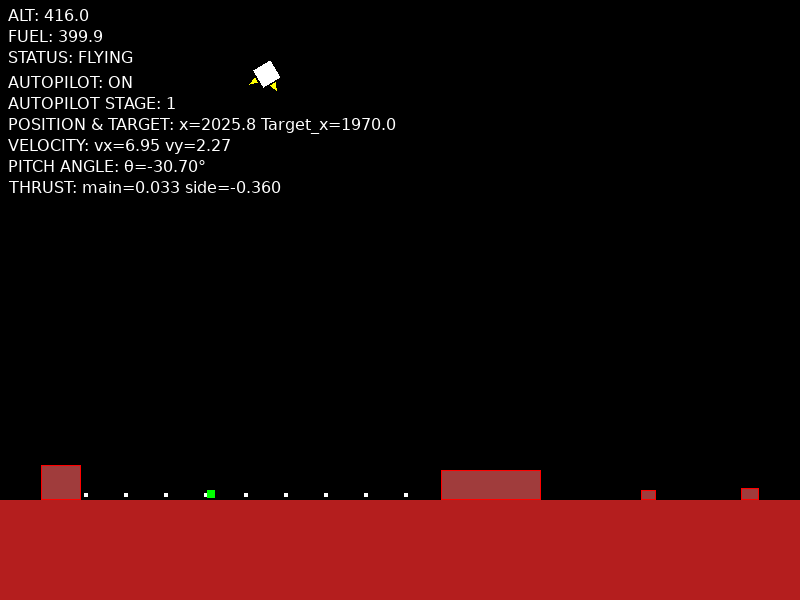
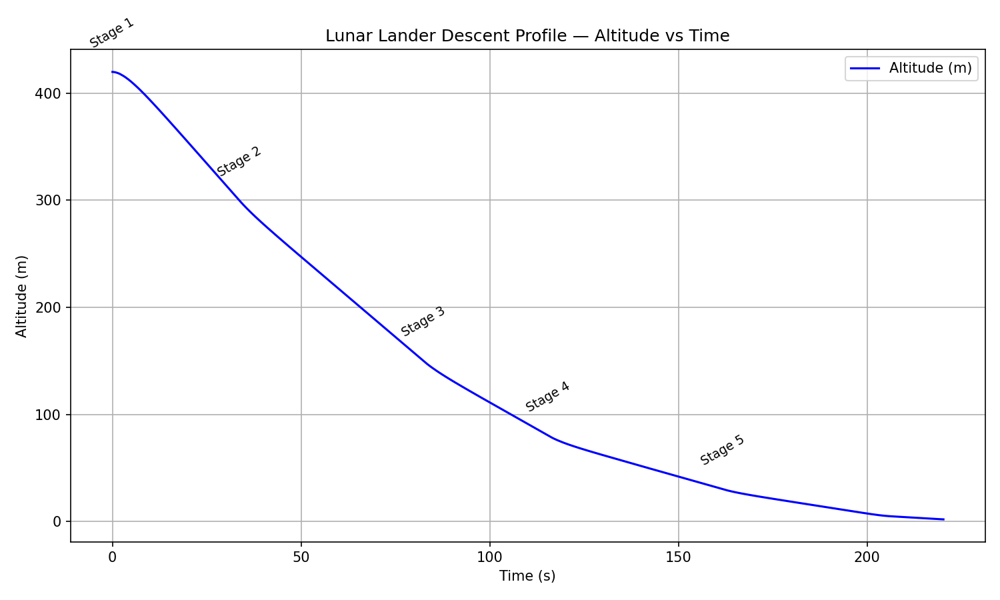
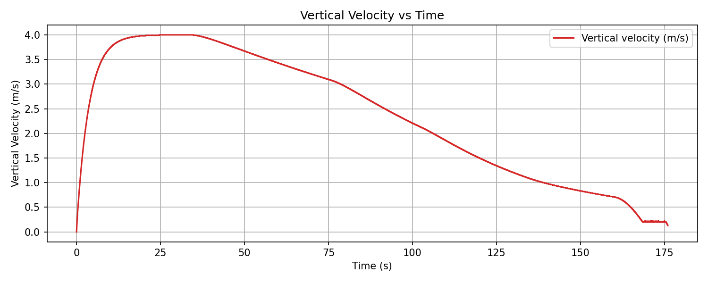
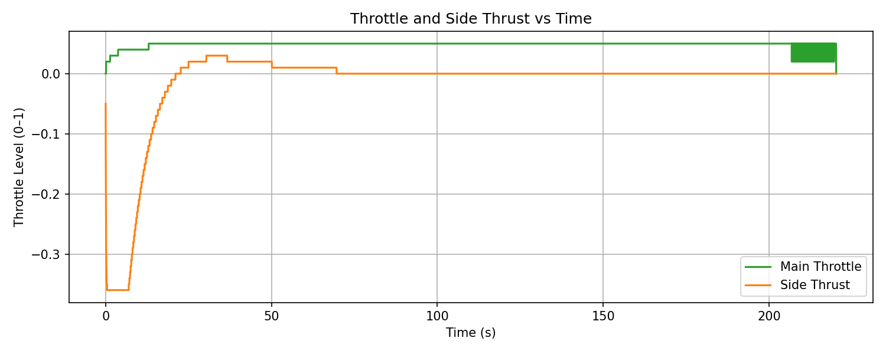
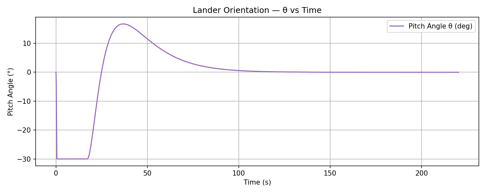

# Lunar Lander Simulation

Author: Alan Crispin (crispinalan)
License: GNU General Public License v3.0 (GPL-3.0)

A 2D physics-based lunar spacecraft descent simulation using SDL3, designed for both educational and experimental purposes. The simulator implements a predictive glide autopilot, inspired by the Apollo Guidance Computer, which performs a high-altitude hazard scan and executes a multi-phase, PD-controlled descent adjusting both throttle and pitch angle

An animated GIF (Graphics Interchange Format) file demonstrating the autopilot landing the lunar module is shown below.


  
The GIF image file displays a sequence of images in succession to create a short, repeating animation of a lunar landing using the autopilot.

## Overview

The purpose of the simulator is to model the descent of the Apollo Lunar Module (LEM) under realistic moon gravity taking mass and pitch angle into account. It was the Apollo Guidance Computer (autopilot) that landed men on the moon. Consequently, the focus of the work has been the development of the autopilot. The autopilot performs a predictive site selection and smooth staged descent. The predictive site selection is  a high-altitude scan to select a safe landing point in an attempt to imitate the  “landing point designator” approach used in the Apollo missions. The descent autopilot is inspired by the Apollo Lunar Module PDI (Powered Descent Initiation) sequence. Stage-dependent target velocities and gains provide smooth transitions between braking, controlled descent, and hover. The result is a mostly stable, repeatable landing sequence. In the simulation both altitude and pitch angle of the landing craft have to be controlled requiring the modelling of both translation and rotational dynamics (2D control).

The simulator has been written in portable C and SDL3 and so can be compiled and run on Linux, macOS, and Windows. The simulator graphics are basic. The lunar module is drawn as a filled rotated rectangle using two triangles. The main and side thruster flames are drawn using triangles.  The moon landscape consists of a surface with rectangles representing hazards that have to be avoided.

## Features

List core features as concise bullet points:

* Physics-accurate translational and rotational motion
* Real-time SDL3 graphics and input
* Autopilot with predictive site selection and staged descent
* Integrated telemetry logging (autopilot_telemetry.csv)
* Configurable tuning parameters for experimentation

## Apollo Missions

Between 1969 and 1972 six NASA Apollo missions (Apollo 11,12,14,15,16 and 17) took astronauts to the moon using the Apollo Lunar Excursion Module or LEM. Each LEM  was able to take two of the three man Apollo crew to the moon so that overall 12 men were taken to the surface of the moon. When close to the moon the Apollo spacecraft established an elliptical parking orbit around the moon. The LEM was then uncoupled from the Command & Service Module which remained in moon orbit. The LEM then slowed and moved into an orbit that took it to about 8 miles (13 km) from the moon's surface and then initiated a PDI (Powered Descent Initiation) sequence to descent and land on the  moon surface. The simulation attempts to imitate the PDI descent stage of the LEM.

| Mission    |Landing Site                 | Notes                                                                                                      |
|------------|-----------------------------|------------------------------------------------------------------------------------------------------------|
| Apollo  11 | Mare Tranquillitatis        | Eagle, Neil Armstrong & Buzz Aldrin first men on the moon                                                  |
| Apollo  12 | Oceanus Procellarum         | Intrepid, astronauts Pete Conrad and Alan Bean visited the Surveyor 3 probe, moonquake recording equipment |
| Apollo  14 | Fra Mauro                   | Two wheeled equipment trolley to carry tools and samples                                                   |
| Apollo  15 | Hadley Rille                | Lunar Roving Vehicle used to explore lunar surface                                                         |
| Apollo  16 | Descartes Highlands         | Lunar Roving Vehicle used to explore lunar surface                                                         |
| Apollo  17 | Taurus-Littrow        	   |Lunar Roving Vehicle used to explore lunar surface                                                          |

Mare Tranquillitatis was chosen as the first landing site because it was a huge impact basin considered flat and so suitable for landing and take-off. Apollo 11 LEM known as Eagle touched down about 4 miles (about 6 km) away from the target position. The landing sites for Apollo's 12, 14, 15, 17 were chosen on the basis of being low-lying and relatively flat. Apollo 12 landed in the a relatively flat area in the Sea of Storms to visit the Surveyor 3 probe (the only probe visited by humans on another world). The Apollo 16 landing site was Descartes Highlands which was a more heavily cratered site. Apollo 13 did not land on the moon due to an explosion in an oxygen tank and so ended up flying around the moon back to earth.
 

## Coordinate System

When the lunar module is in free fall, it is pulled toward the Moon’s surface by **lunar gravity**, approximately:

```
const float GRAVITY = 1.62f;
```
This is about 16.6% of Earth's gravity, due to the Moon’s smaller mass and radius.

The simulation uses a 2D Cartesian coordinate system where:

(0, 0) is the top-left corner of the screen.

The x-axis increases to the right.

The y-axis increases downwards.

Thus, during free fall, the lander’s y value increases as it descends.

The altitude (alt) above the surface is calculated using:
```
float alt = (float)(SURFACE_Y - lander->y);
```
If SURFACE_Y = 520 and lander->y = 20, then alt = 500.

The → (arrow) operator is used to access members of a structure pointer. For example, lander->y retrieves the y coordinate of the lander structure.

## Lander Structure

The lander’s physical and control state is stored in a structure:

```
typedef struct {
    float x, y;			//position
    float vx, vy;		//velocity
    float thrust_level;        // main engine throttle (0.0–1.0 )
    float side_thrust_level;   // side thrusters (-1.0=left, +1.0=right)
    float fuel;                // remaining fuel 
    float angle;    
    float dry_mass;            // dry mass (kg) of the lander **without** fuel     
    float theta;     	   	// orientation radians (0 = upright engines down)
    float omega;      		// angular velocity radians/sec    
    bool thrust;   
    bool is_landed;
    bool is_crashed;
    bool is_hovering;
    bool hazard_ahead;  
    bool left_thruster;
    bool right_thruster;
} Lander;
```

The craft has three engines:

* One main engine for vertical thrust
* Two side thrusters for lateral motion

The fields thrust_level and side_thrust_level determine the normalized power levels of these engines.

Fuel level is limited and decreases over time.


##  Physics Model


##  Translational and Rotational Dynamics

The lunar lander behaves as a rigid body in 2D space. Its state is described by:


| Symbol | Meaning                     | Units |
|--------|---------------------------- |-------|
| x, y   | Position                    | meters |
| vx, vy | Velocity components         | m/s |
| θ      | Orientation angle (radians) | rad |
| ω      | Angular velocity            | rad/s |
| FT     | Main engine thrust          | N |
| FS     | Side thruster force         | N |
| I      | Moment of inertia           | kg·m² |


### Translational Motion (Linear Dynamics)

According to Newton’s Second Law:

F_net = m · a

where `F_net` is the sum of gravity, thrust, and side forces. The vertical component of thrust controls altitude; the horizontal component controls drift.

The simulator integrates velocity and position over time using **semi-implicit Euler**:

```
v_next = v + a * dt
x_next = x + v_next * dt
```

This integration method is slightly more stable than the explicit form, especially with large accelerations.

### Rotational Motion (Angular Dynamics)

Rotation follows the angular version of Newton’s law:

τ = I · α

where `τ` is torque, `I` is the moment of inertia, and `α` is angular acceleration.

For a rectangular lander:

I = (1/12) · m · (w² + h²)

Heavier or wider landers have larger inertia and rotate more slowly.

The autopilot applies a **pitch damping** control law:

ω_cmd = −Kp * (θ − θ_target) − Kd * ω

This combination of proportional (`Kp`) and derivative (`Kd`) terms stabilizes rotation much like a car’s suspension damps oscillations.

### Coupled Dynamics

Because the thrust vector is tilted by the pitch angle θ, both vertical and horizontal accelerations are linked:

```
ax = (FT / m) * sin(θ) + a_side
ay = (FT / m) * cos(θ) − g
```

At small angles, `cos(θ) ≈ 1`, so vertical control is dominated by the main engine while `sin(θ)` affects horizontal glide.


### Control Objectives

| Axis         | Actuator     | Control Type      | Goal |
|:------------:|:-------------:|:----------------:|:-------:|
| Vertical     | Main thruster | PD control on vy | Manage descent rate and touchdown |
| Lateral      | Side thrusters | PD control on x | Glide to target site |
| Rotational    | Torque control | PD control on θ | Keep lander upright |


## Physics Integration Explained

Every frame, the simulator integrates forces into motion using **semi-implicit Euler integration**. This technique first updates velocity, then uses that to update position:

```
v += a * dt
x += v * dt
```
In contrast, explicit Euler (`x += v*dt; v += a*dt;`) can cause instability, especially when the acceleration changes rapidly for example, when thrust toggles or the lander rotates quickly.

For rotation, the same logic applies:
```
ω += α * dt
θ += ω * dt
```
This produces smooth angular motion and prevents runaway oscillation. The timestep `dt` is derived from SDL’s frame time (typically 1/60 s).

These govern both manual and autopilot flight and are integrated numerically each frame in StepLander().

## From Equations to Code

| Physical Concept    | Equation                                 | Code Function                                                      |
| ------------------- | ---------------------------------------- | ------------------------------------------------------------------ |
| Vertical motion     | `a_y = (T/m) * cos(θ) - g`               | `StepLander()` integrates vertical acceleration and velocity       |
| Horizontal motion   | `a_x = (T/m) * sin(θ)`                   | `StepLander()` integrates horizontal drift                         |
| Rotational dynamics | `τ = I * α` and `I = (1/12)·m·(w² + h²)` | `StepLander()` computes moment of inertia and angular acceleration |
| PD pitch control    | `ω̇ = -Kpθ - Kdω`                        | `ComputeRollControl()` damps and corrects tilt                     |
| Descent profile     | `v_y_target(alt)` piecewise schedule     | `AutoPilot_Update()` defines smooth multi-phase descent            |
| Lateral control     | `side_thrust = Kp·dx - Kd·vx`            | `AutoPilot_Update()` aligns over target                            |
| Thrust modulation   | `thr = (g - a_y_des) / (T_max/m)`        | `AutoPilot_Update()` computes throttle ratio                       |

###  Equation Definitions Table

| Symbol | Description | Units | Appears In |
|:-------:|:-------------|:-------|:------------|
| **m** | Total mass of lander (dry mass + fuel mass) | kg | All dynamics equations |
| **w**, **h** | Width and height of the rectangular lander | m | Moment of inertia |
| **I** | Moment of inertia: resistance to angular acceleration (`I = (1/12)·m·(w² + h²)`) | kg·m² | Rotational dynamics |
| **θ (theta)** | Pitch angle (0 = upright, positive clockwise) | radians | Thrust vectoring, rotation |
| **ω (omega)** | Angular velocity | rad/s | Rotational integration |
| **T** | Instantaneous main engine thrust | N (kg·m/s²) | Translational dynamics |
| **Tₘₐₓ** | Maximum available thrust from main engine | N | Throttle modulation |
| **thr** | Normalized throttle command (`0.0–1.0`) | — | Autopilot control loop |
| **aₓ**, **a_y** | Horizontal and vertical acceleration | m/s² | Translational dynamics |
| **a₍y,des₎** | Desired vertical acceleration (from PD controller) | m/s² | Thrust control law |
| **g** | Lunar gravity (≈ 1.62 m/s²) | m/s² | Vertical motion |
| **vₓ**, **v_y** | Horizontal and vertical velocity | m/s | State variables |
| **x**, **y** | Horizontal and vertical position (surface coordinates) | m | World frame |
| **τ (tau)** | Torque generated by off-center thrust | N·m | Rotational dynamics |
| **Δt** | Time step between simulation frames | s | Numerical integration |
| **Fₛ (side)** | Side thrust from lateral thrusters | N | Lateral control |
| **Kp**, **Kd** | Proportional and derivative control gains | — | PD control equations |
| **v₍y,target₎** | Target vertical velocity (altitude-dependent) | m/s | Autopilot descent logic |
| **v₍y,err₎** | Vertical velocity error (`v₍y,target₎ – v_y`) | m/s | PD control |
| **a₍y,des₎ = K_v·v₍y,err₎** | Desired acceleration from velocity error | m/s² | PD control output |
| **mass_scale** | Normalization ratio `(nominal_mass / current_mass)` | — | Thrust modulation |
| **hover_thr** | Hover throttle fraction `(g / (Tₘₐₓ/m))` | — | Descent stabilization |

T/m  is the thrust-to-mass ratio, i.e. how much acceleration you get for each unit of thrust.

### Physics Integration 

### Translational Dynamics
The lander’s position and velocity are integrated every frame:

```
vx += ax * dt
vy += ay * dt
x  += vx * dt
y  += vy * dt
```

Forces come from thrust (vector-decomposed via θ), gravity, and side thrusters.

### Rotational Dynamics

The lander rotates according to Newton’s rotational law:

```
torque = side_thrust * lever_arm
α = torque / I
ω += α * dt
θ += ω * dt
```

The moment of inertia term

`I = (1/12)·m·(w² + h²)`

determines how resistant the lander is to changes in rotation. A wider/heavier craft resists rotation more.

## Autopilot System

The autopilot decomposes control into three independent PD loops:
```
Vertical PD loop adjusts throttle to achieve target descent rate.
Lateral PD loop adjusts side thrust to keep position over target.
Pitch loop damps attitude errors to maintain stability.
```

There is also a final descent flare phase. These are described below.

###  1 Vertical Descent Control

Goal: Maintain a safe vertical descent rate (`vy`).

```
vy_error = target_vy − vy
ay_des = Kv * vy_error
thr = (g − ay_des) / (main_thrust_accel * mass_scale)
```

Increasing `Kv` reacts faster but can cause oscillation.
Decreasing `Kv` makes descent slower but smoother.

### 2 Lateral Glide Control

Goal: Adjust side thrusters to glide toward the selected landing site.

```
dx = target_x − x
side_thrust = Kp_lat * dx − Kd_lat * vx
```

`Kp_lat` pulls the lander toward the target.
`Kd_lat` damps overshoot by opposing horizontal velocity.

### 3 Pitch (Attitude) Control

Goal: Keep the lander upright and stable (pitch stabilization).

```
θ_error = θ − θ_target
ω_cmd = −Kp_theta * θ_error − Kd_theta * ω
```

The control law adds a natural **bias toward upright** orientation and **smooths angular velocity**, allowing stable hover and flare without sudden flips.
.

### Flare & Landing Logic

Below  FLARE_ALT (about 25 m), the autopilot transitions into a *flare* phase. It gradually raises thrust to decelerate smoothly before touchdown.

The flare profile is tuned empirically:

```
float thr = (GRAVITY - ay_des) / (MAIN_THRUST_ACCEL * mass_scale);
```

This helps prevent hard landings and compensates for fuel mass reduction near the surface.

### Predictive Site Selection (Terrain Safety)

Terrain safety is determined through a predictive scan routine that evaluates several lateral positions below the vehicle, assigning each a safety score based on local hazard geometry. The white dots are the sample positions evaluated in each scan sweep. The highest-scoring site becomes the target landing point, shown visually as a green marker on the surface. The predictive, higher-altitude scan to select a landing point is attempting to simulate the  “landing point designator” approach used in the Apollo missions. The core functions and their purpose are shown below.

```
PredictiveScan() 		-produces N white dots
ComputeLandingZoneSafetyAtX()   -produces safety score per dot
SelectBestSite()		-picks green dot (target) 
```
The PredictiveScan() function implements a simple loop scanning columns in front of the current lander and stores top candidates into ap->site_mem. ComputeLandingZoneSafetyAtX() accepts an x_center parameter and returns score. SelectBestSite() picks the best candidate (highest weighted score).


## Telemetry and Analysis

Running the simulation creates the CSV file called autopilot_telemetry.csv. The columns are shown below.

```
time	stage	altitude	x	target_x	vx	vy	thr	side	angle
```
```
time = simulation time
stage = lander stage (1,2,3 etc.)
altitude = the height above the lunar surface (lander)
x =x-asis position
targer_x = safe landing position
vx = velocity x-axis
vy = velocity y-axis
thr= main engine thrust
side = side thrust (-1.0=left, +1.0=right)
angle = pitch angle
```

This data can be used for telemetry analysis of the autopilot. The autopilot logic is structured in discrete stages representing key phases of a lunar descent. The stages are shown on the altitude versus time plot shown below.



The shows a steady descent which is what is required for a safe landing.

The vertical velocity (vy) versus time plot for the autopilot is shown below.


The first autopilot logic changed desired velocity targets at specific altitude thresholds using conditional statements leading 
 to a “staircase” shape in the velocity profile plot. Each time the lander crossed one of these altitude thresholds, the desired vertical velocity changed abruptly and so the throttle PD loop adjusted thrust in discrete steps. These transitions have been smoothed by linearly interpolating target_vy with altitude. The velocity plot now shows a smooth curve as the lander descends.

The main engine throttle and side thrust profiles plotted again time during an autopilot landing are shown below.


The pitch angle versus time plot is shown below. There is a rapid correction in pitch angle at the start of the simulation, after which the lander stabilizes and transitions smoothly to a pitch angle near zero.




### Expected Telemetry Behaviour

The simulation logs telemetry to `autopilot_telemetry.csv`. Typical plots and their expected shapes are described below; these help verify the autopilot behaviour.

| Plot (column) | Expected Shape | Physical Meaning / Diagnoses |
|---|---:|---|
| **Altitude vs Time** (`altitude`) | Smooth, generally monotonic descent; concave-down near surface (flare) | A controlled descent. A climb or rising altitude indicates too much thrust or wrong thrust vector. |
| **Vertical Velocity vs Time** (`vy`) | Piecewise plateaus with transitions (staircase) | Each plateau corresponds to a staged `target_vy`. Sharp spikes imply thrust saturation or sudden attitude changes. Smooth the `target_vy` schedule to remove steps. |
| **Horizontal Velocity vs Time** (`vx`) | Decay to near-zero as lateral control works | If `vx` oscillates or grows, lateral gains are too high/unstable or target locking is misconfigured. |
| **Throttle (thrust_level) vs Time** (`thr`) | Oscillatory but bounded; higher near flare, lower during steady glide | Throttle reacts to `vy` error and may oscillate if PD gains are too aggressive. Sudden jumps correlate with attitude transients. |
| **Side Thruster vs Time** (`side_thrust_level`) | Smooth adjustments; short bursts for lateral corrections | Repeated switching indicates underdamped lateral controller or noisy target. |
| **Pitch Angle vs Time** (`theta`) | Damped transient(s) → converge to 0° | Large initial swings indicate aggressive lateral/attitude commands. Persistent oscillation means attitude controller is underdamped; slow return indicates overdamped/low gains. |
| **Angular Rate vs Time** (`omega`) | Peaks during transients then damps to near-zero | Large steady `omega` is bad (rotating): tune `Kp`/`Kd` or add stronger damping. |

These plots confirm that the autopilot is correctly balancing thrust, descent rate, and orientation.

## Parameter Tuning 

The simulation exposes a set of constants that model the lunar environment, engine power, and controller behaviour. Adjusting these values demonstrates how a closed-loop PD controller responds to different vehicle masses and  thrust-to-weight ratios. You can experiment with constants at the top of main.c.  See tuning Appendix.

## Installation & Building

SDL3 has been chosen for the 2D simulation because of

* Cross-platform portability (Windows / Linux / macOS)
* Simple event handling (keyboard, mouse)
* Built-in timing and rendering loop

### Build From Source (Debian 13)

The instructions below show how to build and run the simulator from source using Debian 13 Trixie. The simulator has been developed using Debian Trixie.

You need to install the following packages.

```
sudo apt-get update
sudo apt install build-essential
sudo apt install pkg-config
sudo apt install libsdl3-dev
```

To check that SDL3 is installed use the following commands.

```
pkg-config --libs sdl3
pkg-config --cflags sdl3
```

Use the MAKEFILE in the src download to compile. 

```
make
```

To run the simulation from the terminal use

```
./lunar
```

Make clean is also supported.

```
make clean
```
### Building from Source (Windows 11)

The instructions below show how to build the simulator from source using Windows 11.

You need to install the compiler MSYS2 (MinGW) on Windows 11. MSYS2 (Minimal SYStem 2) is a software development platform for Windows that provides a Unix-like environment, making it easier to build and run software ported from Linux. The official [MSYS2 website](https://www.msys2.org/). You then need to set up SDL3 on Windows 11. The official [SDL website](https://github.com/libsdl-org/SDL/releases). Follow the instructions below.

1. **Install MSYS2 (MinGW)**  
   - Download from [https://www.msys2.org/](https://www.msys2.org/)  
   - Run the installer and follow the default setup instructions.

2. **Install GCC (MinGW-w64)**  
   In the MSYS2 terminal (Start → MSYS2 MINGW64):
```
bash
pacman -Syu       # update all packages
pacman -S mingw-w64-x86_64-gcc
```
3. **Install SDL3 development libraries**

Download SDL3 prebuilt binaries from SDL releases
Extract to a folder, e.g. C:\SDL3\.
You should now have:
```
C:\SDL3\include
C:\SDL3\lib

```

4. **Build the simulator**
```
gcc main.c -o lunar.exe -I/c/SDL3/include -L/c/SDL3/lib -lSDL3 -lm
```
5. **Run the simulation**
Make sure these files are in the same directory:
```
lunar.exe
SDL3.dll
assets/
```

Then run:
```
./lunar.exe

```
Note: MinGW uses the same GCC compiler toolchain internally — only adapted for Windows paths and linking.

### Building from Source (macOS)

1. **Install SDL3 via Homebrew**
 ```
 bash
 brew install sdl3
 ```
 
2. **Compile**
```
gcc main.c -o lunar -lSDL3 -lm

```
3. **Run**
```
./lunar
```

## Controls & Keyboard Commands

Short table of keys:

| Key   | Action           |
| ----- | ---------------- |
| ↑     | Main thrust      |
| ← / → | Rotate           |
| P     | Toggle autopilot |
| R     | Reset lander     |
| Esc   | Quit             |

You can switch off the autopilot using the P-key (Pilot key) and then fly the lunar module manually using the W(UP ARROW), A(LEFT ARROW) and D(RIGHT ARROW) keys. 


## Educational Objectives

The simulator has been developed as a physics simulation of the Apollo moon landings and it is hoped that it may be useful for educational purposes. It is a practical example where it is necessary to understand physics, computer control systems, software development and real-time simulation.

## Future Work (3D Simulation) 

I am working on extending the simulation to 3D so that it should be possible to read a grayscale lunar height map (from e.g. NASA’s LRO data), sample it into a mesh and rendering it as a 3D surface.

SDL3 alone cannot render 3D scenes, so [OpenGL](https://www.opengl.org/) would be required. However, the physics logic (StepLander, AutoPilot_Update, etc.) would still apply but would need to be extended to handle vectors instead of scalars. So an open source 3D simulation could be produced using OpenGL and SDL3. SDL3 would manage input, windowing, and timing, while OpenGL handles 3D rendering and camera projection.

* Extending to 3D is a mathematical generalisation: every 2D equation simply gains a third axis term.
* A new moment of inertia tensor replaces the scalar I.
* In 2D, torque and angular acceleration are scalar; in 3D, they are vectors

A 3D simulation would mimic a real spacecraft control such as the Apollo Lunar Module descent engines, which actively modulates gimbal pitch/yaw and use RCS (Reaction Control System) thrusters for roll control. 

## License

The lunar lander simulator is released under the terms of the [GNU Lesser General Public License version 3.0](https://www.gnu.org/licenses/licenses.html). 

Under no circumstances should you use the autopilot developed in this simulation to attempt to land a craft on the moon or any other planet. It has been developed for educational purposes. If in doubt consult a NASA engineer.

## Versioning

[SemVer](http://semver.org/) is used for versioning. The version number has the form 0.0.0 representing major, minor and bug fix changes.

## Author

* **Alan Crispin** [Github](https://github.com/crispinprojects)

## Project Status

Active and under development.

## Acknowledgements

* [Apollo 11: The Complete Descent](https://www.youtube.com/watch?v=xc1SzgGhMKc)

* [Apollo 12: The Complete Descent](https://www.youtube.com/watch?v=NkcIxPi4_S4)

* [Light Years Ahead The 1969 Apollo Guidance Computer](https://www.youtube.com/watch?v=B1J2RMorJXM&t=203s)

* [Simulating a lunar landing](https://www.spaceacademy.net.au/flight/sim/lunasim.htm)

* [BBC Sky At Night: All 6 Apollo landing sites on the Moon](https://www.skyatnightmagazine.com/advice/skills/see-apollo-landing-sites-moon)

* [SDL](https://www.libsdl.org/)

* [chatGPT](https://chatgpt.com/)

* [Gemini](https://gemini.google.com/app)

* [Geany](https://www.geany.org/) is a lightweight source-code editor [GPL v2 license](https://www.gnu.org/licenses/old-licenses/gpl-2.0.txt)

* [Debian](https://www.debian.org/)


## Appendix: Autopilot Tuning

The key autopilot parameters which can be tuned are shown below.


| Loop     | Adjust                      | If Oscillates | If Sluggish  | Units / Range                |
| -------- | --------------------------- | ------------- | ------------ | ---------------------------- |
| Vertical | `KV_VERTICAL`               | ↓ smaller     | ↑ larger     | 0.15–0.35                    |
| Lateral  | `KP_LATERAL` / `KD_LATERAL` | ↓ KP or ↑ KD  | ↑ KP or ↓ KD | KP≈0.002–0.004, KD≈0.05–0.08 |
| Attitude | `KP_THETA` / `KD_THETA`     | ↓ KP or ↑ KD  | ↑ KP or ↓ KD | KP≈0.15–0.25, KD≈0.40–0.55   |
| Flare    | `HOVER_THRUST_FACTOR`       | ↓ factor      | ↑ factor     | 1.0–1.3 × hover_thr          |
| Landing  | `MAX_VY/VX`                 | loosen (↑)    | tighten (↓)  | vx<2.5, vy<1.5 typical       |


### Autopilot Tuning Log Template

| Date | Constant(s) Changed | Previous Value(s) | New Value(s) | Effect Observed | Result / Notes |
|------|---------------------|-------------------|---------------|------------------|----------------|
| YYYY-MM-DD | `KV_VERTICAL` | 0.25 | 0.30 | Reduced hover, faster descent | Smoother transition between altitude bands |
| YYYY-MM-DD | `KP_LATERAL`, `KD_LATERAL` | 0.0025, 0.06 | 0.003, 0.05 | Less lateral drift | Slight oscillation damped |
| YYYY-MM-DD | `KP_THETA`, `KD_THETA` | 0.25, 0.40 | 0.22, 0.45 | Smaller angle overshoot | Critical damping near surface |
| YYYY-MM-DD | `HOVER_THRUST_FACTOR` | 1.10 | 1.25 | Softer touchdown | Slight hover before landing |
| YYYY-MM-DD | `MAX_VY_FOR_SAFE_LANDING` | 1.5 | 1.2 | Reduced bounce | Reliable landing detection |

After each landing test, record tuning variables, what was observed and whether it improved or worsened the landing.

### Approach Trajectory

You can adjust the starting position and velocity in the  lander initialisation function called InitLander() to simulate a faster or a more offset approach trajectory. The lunar x-axis surface world is 8000 pixels and so to land in the 2000 pixel region you would set l→x to 2000.0f. To simulate a faster entry to the moon atmosphere increase l→vx. Some typical values are shown below.
```
l->x = 3000.0f;
l->vx = 20.0f;
```

